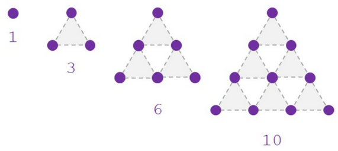
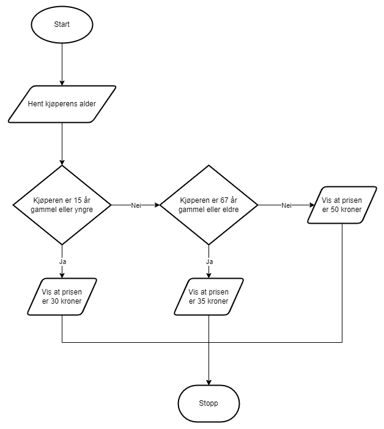
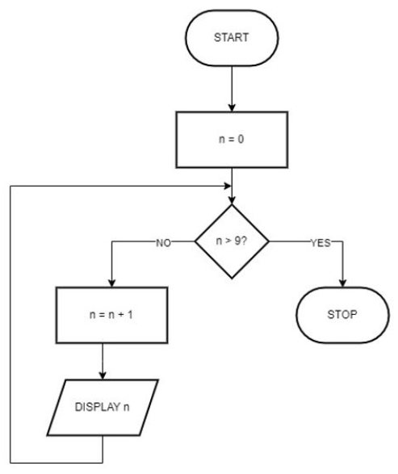
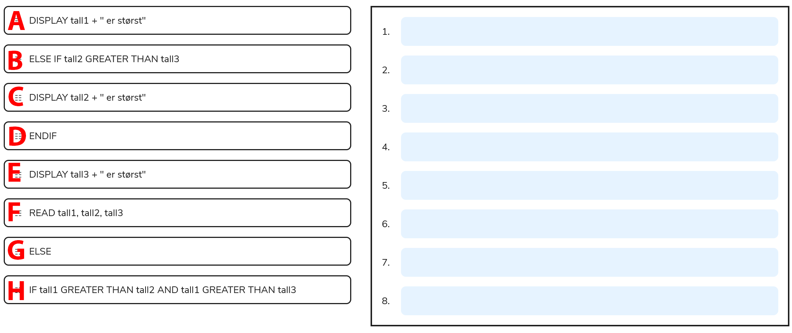

# Blandede oppgaver fra tidligere eksamener

## Oppgaver: Pseudokode

### Oppgave 2.1

> Oppgave 1 fra eksamen H23

Hvilket av følgende er ikke et typisk kjennetegn på pseudokode? Velg riktig alternativ.

- [ ] den har uformell syntaks.
- [ ] den ligner på vanlig menneskespråk.
- [x] den kan kjøres direkte på en datamaskin.
- [ ] den brukes ofte i planleggingsfasen av programmering.

### Oppgave 2.2

> Oppgave 2 fra eksamen V23

Ta utgangspunkt i følgende pseudokode:

```pseudo
SET m TO 3
SET i TO 1
WHILE i GREATER THAN m
  DISPLAY "Lykkelig dag!"
  INCREMENT i
ENDWHILE
```

Hvor mange ganger blir teksten "Lykkelig dag!" skrevet ut?

- [ ] tre ganger
- [ ] to ganger
- [ ] én gang
- [x] ingen ganger

### Oppgave 2.3

> Oppgave 4 fra eksamen H23

Hvilke av de følgende sekvensene med pseudokode skriver ut tallene fra og med 1 til og med 5? Flere alternativer kan være riktige. Velg riktige svar.

```pseudo
1.
SET i TO 1
FOR hver i LESSER OR EQUAL 5
  PRINT i
ENDFOR

2.
SET i TO 1
WHILE i < 5
  PRINT i
  INCREMENT i
ENDWHILE

3.
SET i TO 0
FOR hver i LESSER OR EQUAL 4
  PRINT i+1
ENDFOR

4.
SET i TO 1
WHILE i <= 5
  PRINT i
  INCREMENT i BY 2
ENDWHILE
```

- [x] 1
- [ ] 2
- [x] 3
- [ ] 4

### Oppgave 2.4

> Oppgave 3 fra eksamen V23

Tallene 1, 3, 6, 10, 15, 21 og så videre kalles for trekanttall. De tilsvarer antallet prikker som vil vises i en likesidet trekant når man bruker et grunnleggende trekantmønster for å bygge trekanten. Se illustrasjonen nedenfor:



Den følgende pseudokoden beskriver en funksjon som regner ut og returner trekanttallet nummer n:

```pseudo
FUNCTION trekanttall (n)
  SET tn TO n * (n+1)/2
  RETURN tn
ENDFUNCTION
```

Bruk funksjonen som er beskrevet ovenfor, og skriv pseudokoden til et program som regner sammen og skriver ut totalsummen av de ti første trekanttallene. Bruk dobbelt mellomrom for innrykk i koden der det er aktuelt. Skriv svaret ditt nedenfor.

> Du kan bruke din egen standard for pseudokode, bare den er hensiktsmessig.

```pseudo
SET i TO 0
SET total TO 0

FOR EACH i LESSER THAN OR EQUAL 10
  INCREMENT total BY trekanttall(i) RETURNING det nye trekanttallet
ENDFOR

DISPLAY total
```

## Oppgaver: Flytdiagram

### Oppgave 2.5

> Oppgave 5 fra eksamnen H23

Et system som beregner billettprisen avhengig av kjøperens alder, bruker følgende regler for billettkategorier:

- Hvis brukeren er 15 år gammel eller yngre, skal brukeren få barnebillett til 30 kroner.

- Hvis brukeren er 16 år gammel eller eldre, skal brukeren få voksenbillett til 50 kroner.

- Hvis brukeren er 67 år gammel eller eldre, skal brukeren få pensjonistbillett til 35 kroner.

Lag et flytdiagram for et program der brukeren skriver inn alderen på kjøperen og programmet regner ut og skriver ut riktig billettpris.

Lag flytdiagrammet i et egnet program, og lagre det i et allment lesbart format (f.eks. pdf eller png).



## Oppgave 2.6

> Oppgave 4 fra eksamen V23

I figuren nedenfor finner du en illustrasjon som viser et flytskjema for en algoritme, og i *kodeboksen* under figuren finner du fire sekvenser med pseudokode.



```pseudo
1:
SET n TO 1
WHILE n LESSER THAN OR EQUAL TO 10
  INCREMENT n
  DISPLAY n
ENDWHILE

2:
SET n TO 0
FOR hver n LESSER THAN OR EQUAL TO 10
  DISPLAY n
ENDFOR

3:
SET n TO 1
WHILE n LESSER THAN 10
  DISPLAY n
  INCREMENT n
ENDWHILE

4:
SET n TO 1
FOR hver n LESSER THAN OR EQUAL TO 10
  DISPLAY n
ENDFOR
```

Hvilken sekvens med pseudokode gir __*lik visning av output*__ som algoritmen beskrevet av flytskjemaet? Velg riktig svar:

- [ ] 1
- [ ] 2
- [ ] 3
- [x] 4

## Oppgaver: Løkker, lister og ordbøker

### Oppgave 2.7

> Oppgave 1 fra eksamen V23

Hva er en while-løkke i programmering? (ett riktig svar)

- [ ] en løkke som kjører et bestemt antall ganger
- [ ] en løkke som kjører til en bestemt hendelse intreffer
- [x] en løkke som kjører så lenge en bestemt betingelse er sann
- [ ] en løkke som kjører så lenge en tilfeldig betingelse er sann

### Oppgave 2.8

> Oppgave 2 fra eksamen H23

Hvilken av de følgende påstandene er riktig om for- og while-løkker innen programmering? Velg riktig alternativ.

- [ ] en for-løkke kan bare brukes med tallsekvenser
- [ ] en while-løkke kjører alltid et bestemt antall ganger
- [x] en for-løkke er best egnet når du vet hvor mange ganger du vil at løkken skal kjøre
- [ ] en while-løkke kan ikke bruke en teller for å holde rede på hvor mange ganger den har kjørt

## Oppgaver: Algoritmer

### Oppgave 2.12

> Oppgave 5 fra eksamen V23

Nedenfor finner du flere linjer med pseudokode. Sorter linjene i riktig rekkefølge, slik at det blir pseudokoden til et program som skal finne det største tallet av tre tall. Tips: Linjene med pseudokode har ikke innrykk/indentering.



Rekkefølge:
1. F
2. H
3. A
4. B
5. C
6. G
7. E
8. D

Resulterer i:

```pseudo
READ tall1, tall2, tall3

IF tall1 GREATER THAN tall2 AND tall1 GREATER THAN tall3
  DISPLAY tall1 + "er størst"
ELSE IF tall2 GRATER THAN tall3
  DISPLAY tall2 + "er størst"
ELSE
  DISPLAY tall3 + "er størst"
ENDIF
```

### Oppgave 2.13

> Oppgave 6 fra eksamen H23

a) Du får i oppgave å finne det nest største tallet i en liste (array) med tall. Dersom det finnes flere like tall som er størst, skal ingen av disse regnes som nest størst. Under finner du fire alternative løsninger for denne oppgaven skrevet i pseudokode. Hvilke to løsninger er riktige?

```pseudo
1
SET størst TO negativt uendelig tall
FOR hvert tall i listen
  IF tall GREATER THAN størst
    SET størst TO tall
  ENDIF
ENDFOR
Fjern størst fra listen
SET nestStørst TO negativt uendelig tall
FOR hvert tall i listen
  IF tall GREATER THAN nestStørst 
    SET nestStørst TO tall
  ENDIF
ENDFOR
DISPLAY nestStørst

2
SET størst TO første tall i listen
SET nestStørst TO andre tall i listen
IF nestStørst GREATER THAN størst
  Bytt størst og nestStørst
ENDIF
FOR hvert tall i listen med start fra tredje tall
  IF tall GREATER THAN størst
    SET nestStørst TO størst
    SET størst TO tall
  ELSEIF tall GREATER THAN nestStørst AND tall NOT EQUAL TO størst
    SET nestStørst TO tall
  ENDIF
ENDFOR
DISPLAY nestStørst

3
SET størst TO negativt uendelig tall
SET nestStørst TO negativt uendelig tall
FOR hvert tall i listen
  IF tall GREATER THAN størst
    SET nestStørst TO størst
    SET størst TO tall
  ELSEIF tall GREATER THAN nestStørst
    SET nestStørst TO tall
  ENDIF
ENDFOR
DISPLAY nestStørst

4
Sorter listen i synkende rekkefølge
FOR hvert tall i listen
    IF tall NOT EQUAL TO neste tall i listen
        DISPLAY neste tall i listen
        avbryt for-løkken
    ENDIF
ENDFOR
```

Velg de to riktige løsningene.

- [ ] 1
- [x] 2
- [ ] 3
- [x] 4

b) Skriv en kort tekst der du vurderer og sammenligner de to løsningene du valgte i punkt a.

Løsning 2 krever ikke at vi sorterer listen vår på forhånd, noe som er mer effektivt enn løsning 4. Derimot når listen først er sortert, blir koden enkel å lese, og den finner det nest største tallet veldig raskt - vi slipper at for-loopen kjører mange ganger.

### Oppgave 2.14

> Oppgave 7 fra eksamen H23

Elementene i en indeksert variabel (liste/array) skal sorteres i stigende rekkefølge etter følgende algoritme: Man sammenligner hvert element fra venstre til høyre i listen med neste element, og hvis elementet er større enn neste element, bytter de plass. Deretter går man videre til neste element og sammenligner på nytt frem til hele listen er gjennomgått. Dette gjentas til hele listen gjennomgås uten at det forekommer noen ombyttinger.

Under finner du deler av pseudokoden for denne algoritmen. Her er a en liste med n elementer, og a[ i ] er elementet på plass i i listen.

```pseudo
SET i TO 0
FOR hver i LESSER THAN n - 1
  IF a[i] GREATER THAN a[i+1]    
    CALL byttPlass()
  ENDIF
ENDFOR
```

> Presisering: byttPlass() er en funksjon som bytter plass på to naboelementer i listen.

a) Hva blir innholdet i listen etter at vi har kjørt programmet representert ved pseudokoden over for listen a = [8, 5, 2, 6, 12], som har n = 5 elementer?
Velg riktig svar.

- [ ] `[ 5, 8, 2, 6, 12 ]`
- [ ] `[ 5, 2, 8, 6, 12 ]`
- [x] `[ 5, 2, 6, 8, 12 ]`
- [ ] `[ 2, 5, 6, 8, 12 ]`

b) Utvid pseudokoden slik at programmet den representerer, sorterer ferdig listen a i stigende rekkefølge etter altgoritmen som er vist øverst. Forklar endringene du gjør. Obs! Du må også lage pseudokode for funksjonen byttPlass().

```pseudo
FUNCTION byttPlass(a)
  SET midlertidig TO a[i]
  SET a[i] TO a[i+1]
  SET a[i+1] TO midlertidig
ENDFUNCTION

SET a TO lista av tallene som skal sorteres
SET n TO lengden av a
SET endring TO true

WHILE endring
  SET endring TO false
  FOR EACH i LESSER THAN n-1
    IF a[i] GREATER THAN a[i+1]
      CALL byttPlass
      SET endring to true
    ENDIF
  ENDFOR
ENDWHILE
```

Løsningen vil endre plasseringen av elementene i listen inntil den ikke finner noen feilplasserte elementer. Løsningen antar at listen a er en pointer, derfor blir ikke listen returnert av funksjonen byttPlass, siden den vil endre på listen direkte ved hjelp av pointeren.

c) Implementer pseudokoden fra punkt b i ditt programmeringsspråk. Listen skal leses inn automatisk, og den ferdig sorterte listen skal skrives til konsollet eller vises i programmet.

```py
tall_input = input("Skriv inn listen med tallene, separert med komma: ")

a = tall_input.split(",")

for i in range(len(a)):
    a[i] = int(a[i])

def bytt_plass():
    midlertidig = a[i]
    a[i] = a[i+1]
    a[i+1] = midlertidig

endring = True

while endring:
    endring = False
    for i in range(len(a)-1):
        if a[i] > a[i+1]:
            bytt_plass()
            endring = True

print(f"Sortert liste: {', '.join(a)}")
```

## Andre oppgaver uten oppgavenummer

### Oppgave 3 fra eksamen H23

Hva er hovedprinsippet bak objektorientert programmering (OOP)? Velg riktig alternativ.

- [ ] å lage lineære og sekvensielle programkoder
- [ ] å bryte ned et problem i et sett med funksjoner
- [x] å representere data og funksjoner som objekter
- [ ] å minimere bruken av variabler
